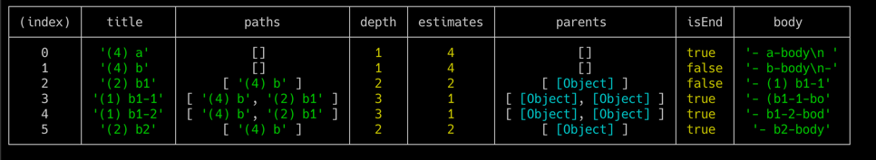

# md-to-github-issues

This is a simple parser for Markdown list.

[live demo](https://hedrall.github.io/md-to-github-issues/)

# how to use (example)

```ts
import * as MDTI from 'md-to-github-issues';
const input = `
- (4) a
    - a-body
      - a-body-1
      - a-body-2
- (4) b
    - b-body
    - (2) b1
        - (1) b1-1
            - (b1-1-body)
        - (1) b1-2
            - b1-2-body
    - (2) b2
        - b2-body
    - b-body-2
`;

const result = MDTI.parse(input);
```

to get 


